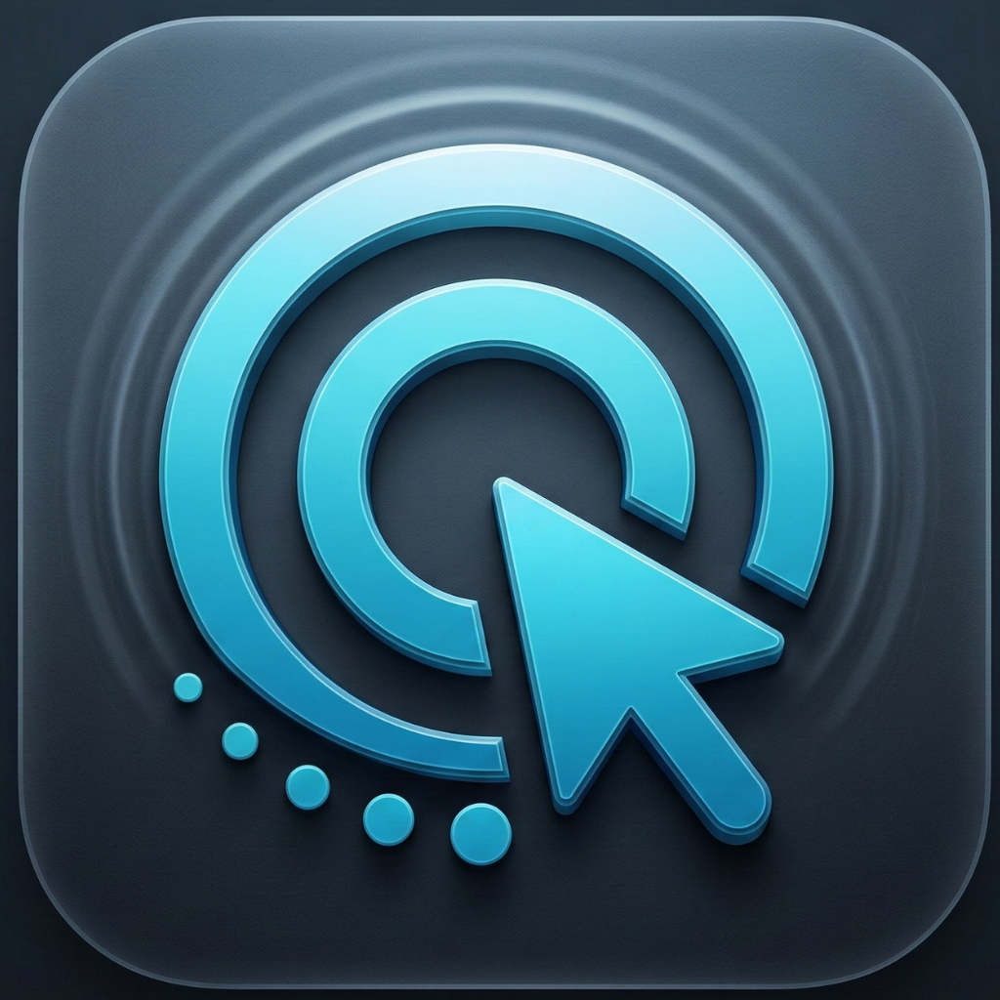
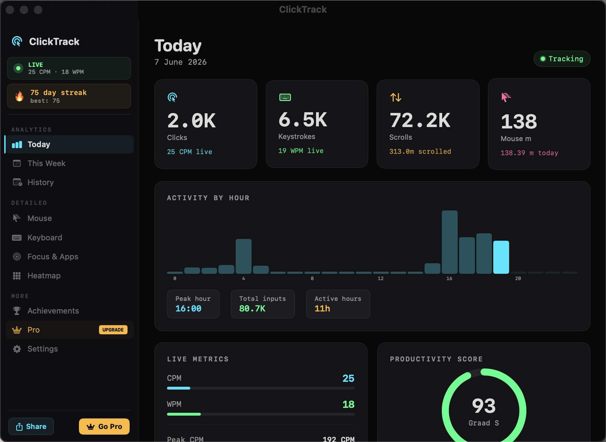
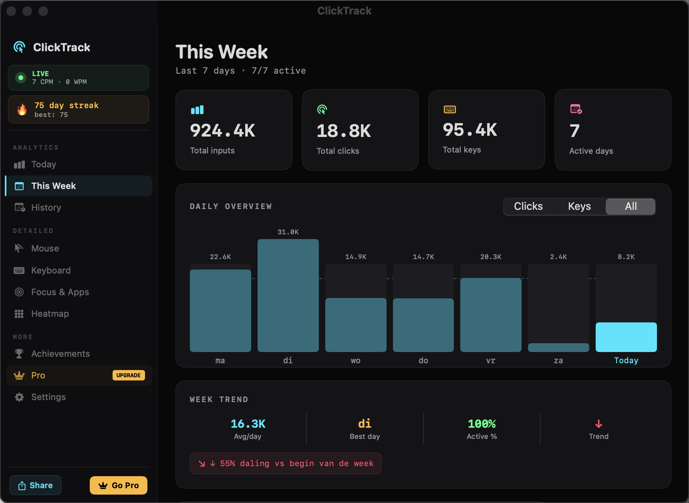
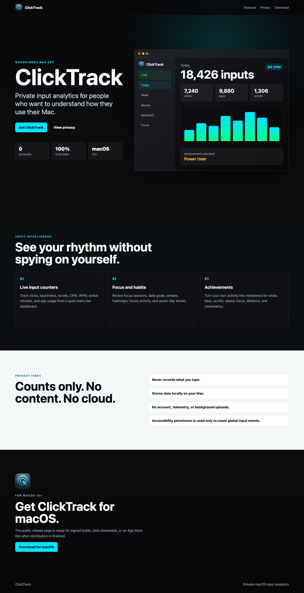

# ClickTrack

  

<h3 align="center">Private input analytics for macOS.</h3>

  Understand your clicks, keys, scrolls, focus sessions, streaks, and habits without recording what you type.

  

  <a href="https://clicktrackapp.com">Website</a>
  ·
  <a href="docs/DISTRIBUTION.md">Distribution notes</a>

  
  
  
  

## Download

ClickTrack is distributed as a direct macOS download, not through the App Store.

| Build | Download | Notes |
| --- | --- | --- |
| Latest macOS build | [ClickTrack-v1.0.2-notarized-legacy-pro.zip](https://github.com/KippieG/clicktrack/releases/download/v1.0.2/ClickTrack-v1.0.2-notarized-legacy-pro.zip) | Xcode Direct Distribution export |
| License-key test build | [v1.0.1 prerelease](https://github.com/KippieG/clicktrack/releases/tag/v1.0.1) | New direct-license flow, not notarized |

> Current status: `v1.0.2` is the notarized legacy Pro build exported from Xcode. It should avoid the unverified warning from the previous unsigned test release. The newer license-key Pro flow still needs a fresh Developer ID notarized archive before replacing this public download.

## Screenshots

| Today | This Week | Product preview |
| --- | --- | --- |
|  |  |  |

## Why ClickTrack

ClickTrack gives you a private dashboard for your Mac activity. It counts input patterns and productivity signals, then turns them into simple daily and weekly insights.

| Live Counters | Focus Rhythm | Achievements |
| --- | --- | --- |
| Track clicks, keys, scrolls, CPM, WPM, active minutes, and app usage from a quiet menu bar app. | Review focus sessions, daily goals, streaks, hourly activity, heatmaps, and seven-day trends. | Turn activity into milestones for clicks, keys, scrolls, speed, focus, distance, and consistency. |

## Privacy First

ClickTrack is built around counting activity, not collecting content.

- Never records what you type.
- Stores data locally on your Mac.
- Does not require an account.
- Does not upload telemetry or analytics.
- Uses macOS Accessibility permission only to count global input events.

## Trial and Pro

The planned direct-download Pro model is:

- Download free.
- 14-day full trial, no credit card.
- $9.99 one-time Pro purchase on the website.
- License key activation inside ClickTrack.

The source code has been prepared for `https://clicktrackapp.com/pro` and Lemon Squeezy license activation. The current `v1.0.2` public download is still the notarized legacy Pro build, so a fresh notarized archive is needed before the license-key version becomes the main download.

## Install

1. Download the ZIP from the latest release.
2. Unzip it and move the app to Applications.
3. Launch ClickTrack.
4. Open System Settings > Privacy & Security > Accessibility.
5. Enable ClickTrack.
6. Restart ClickTrack if macOS asks for it.

If macOS still blocks the app, right-click it and choose Open. Do not edit the exported app bundle after Xcode distribution, because changing bundle contents can invalidate the signature.

## Release Checklist

- [x] Public GitHub repository
- [x] GitHub Releases download page
- [x] Direct-download Pro/trial app flow
- [x] Developer ID / notarized legacy Pro ZIP
- [x] App screenshots in README
- [ ] Developer ID signed license-key production build
- [ ] Apple notarized license-key DMG
- [ ] Live Lemon Squeezy checkout connected to `clicktrackapp.com/pro`

## Links

- Website: [clicktrackapp.com](https://clicktrackapp.com)
- Releases: [github.com/KippieG/clicktrack/releases](https://github.com/KippieG/clicktrack/releases)
- Distribution: [docs/DISTRIBUTION.md](docs/DISTRIBUTION.md)
